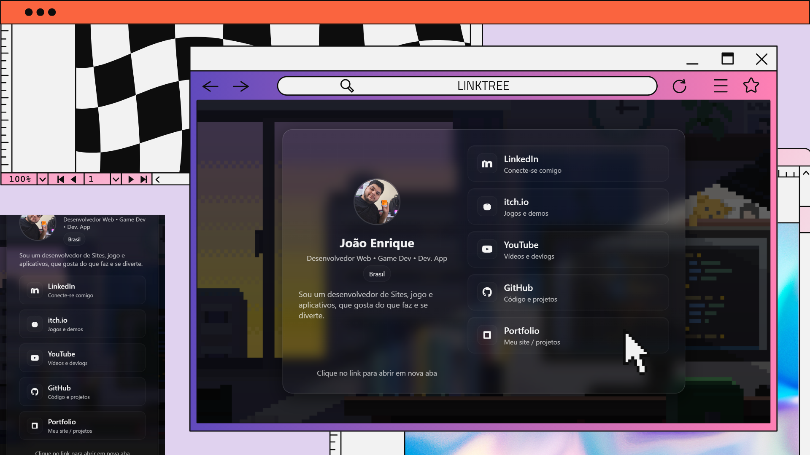

# 🌐 Linktree
> Um Linktree moderno com efeito **Glassmorphism**, desenvolvido com **HTML, CSS e JavaScript**, para reunir todos os seus links em um só lugar com um visual limpo e responsivo.

---

## 🚀 Demonstração
🔗 **Acesse aqui:** [link do deploy](https://linktree-eight-gules.vercel.app/)  
📸 **Preview:**  


---

## 📚 Sumário
- [Sobre](#-sobre)
- [Tecnologias](#-tecnologias)
- [Funcionalidades](#-funcionalidades)
- [Como Rodar o Projeto](#-como-rodar-o-projeto)
- [Como Usar](#-como-usar)
- [Screenshots](#️-screenshots)
- [Aprendizados](#-aprendizados)
- [Estrutura de Pastas](#-estrutura-de-pastas)
- [Roadmap](#-roadmap)
- [Autor](#-autor)
- [Licença](#-licença)

---

## 💡 Sobre
Este projeto é uma página de **Linktree personalizada**, criada com o objetivo de centralizar todos os meus links profissionais e de portfólio em um único lugar.

O design utiliza o conceito de **Glassmorphism**, com transparência, desfoque e efeitos sutis de sombra, proporcionando uma aparência elegante e moderna.  
Foi desenvolvido utilizando **HTML, CSS e JavaScript puro**, sem frameworks.

---

## 🛠️ Tecnologias
As principais tecnologias utilizadas neste projeto foram:

- **HTML5**
- **CSS3** (Glassmorphism, animações, responsividade)
- **JavaScript**
- **Live Server** (para rodar localmente)
<div align="right">
  
  
  
  
  
</div>


---

## 📚 Funcionalidades
- [x] Design moderno com **Glassmorphism**
- [x] Totalmente **responsivo** para celulares e desktops
- [x] Links com **animações de hover**
- [x] Facilidade para **personalizar cores, links e imagem de fundo**
- [x] Ícones e cards personalizáveis (LinkedIn, Itch.io, YouTube, GitHub e Portfólio)

---

## 📦 Como Rodar o Projeto
Siga as etapas abaixo para executar o projeto localmente:

```bash
# Clone este repositório
git clone https://github.com/joao-enrique/linktree.git

# Acesse a pasta do projeto
cd linktree

# Abra o projeto com o Live Server
# (Clique com o botão direito no arquivo index.html e selecione "Open with Live Server")
```
> 💡 Caso não tenha o Live Server instalado, procure a extensão “Live Server” no VS Code Marketplace e instale.

## 🧪 Como Usar
1. Substitua a imagem de fundo no arquivo `style.css`.

2. Edite os links dentro do `script.js`(LinkedIn, Itch.io, YouTube, GitHub e Portfólio).

3. Salve e atualize o navegador para visualizar as alterações.

## 🖼️ Screenshots
TODO
## 🧠 Aprendizados
Durante o desenvolvimento deste projeto aprimorei:
</br>
- O uso de Glassmorphism em CSS (blur, transparência e sombras suaves);
- Organização e responsividade com Flexbox e media queries;
- Criação de interfaces simples e elegantes utilizando apenas HTML, CSS e JS.

## 📁 Estrutura de Pastas
/ </br>
├─ index.html </br>
├─ css/ </br>
│  └─ style.css </br>
├─ js/ </br>
│  └─ script.js </br>
└─ assets/ </br>
   └─ imagens, ícones e fundo </br>

## 🚧 Roadmap

- [todo] Permitir animações de entrada (fade-in)

- [todo] Criar versão multilíngue (PT/EN)

## 🔗 Links Úteis
💾 **Deploy:** [link](https://linktree-eight-gules.vercel.app/)
💻 **Portfolio:** [link](https://meu-portfolio-lemon-sigma.vercel.app/)

## 👨‍💻 Autor
Feito com 💜 por [João Enrique](https://meu-portfolio-lemon-sigma.vercel.app/)
<div align="right">
  <a href="https://www.linkedin.com/in/joao-enrique-dev/" target="_blank">
    
  </a>
  <a href="https://www.youtube.com/@joaocodedev" target="_blank">
    
  </a>
  <a href="https://jedev1.itch.io/" target="_blank">
    
  </a>
</div>

## 📜 Licença
Este projeto está sob a licença MIT — veja o arquivo [LICENCE](./LICENSE) para mais detalhes.

## ⭐ Se este projeto te inspirou, não esqueça de deixar uma estrela no repositório!